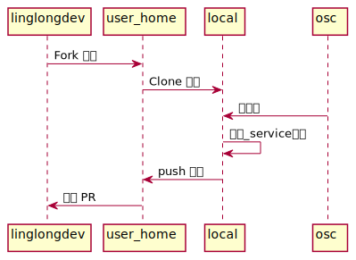
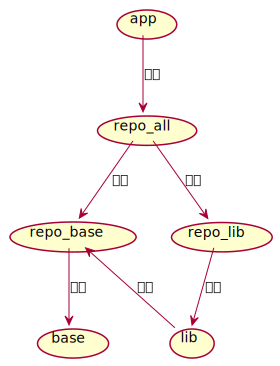
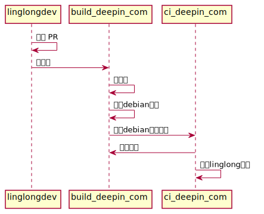

# 介绍

这个仓库是玲珑软件的构建集成仓库，用于玲珑软件的自动化集成。

在这个仓库添加的软件包会在 <https://build.deepin.com> 自动构建，并在构建后发布到 <https://ci.deepin.com/repo/linglong>（TODO 仓库还没准备好）

构建状态：

- <https://build.deepin.com/project/show/linglong:repo:lib>

## 玲珑包分类

玲珑包有三个类型：

- app
  
  一般是提供用户界面ui程序，
- lib

  是 app 构建或运行所需的依赖
- runtime

  可以理解为一系列的依赖集合，比如 org.deepin.Runtime 包含 qt、dtk 等依赖。

**app 包请添加到这个仓库的 app 目录，runtime 和 lib 包请添加到这个仓库的 lib 目录**。

## 添加软件包

1. Fork 并 Clone 这个仓库到本地
2. 在本地仓库的包类型子目录（如 app）执行 `osc mkpac $包名` 创建包 *（osc命令可使用apt安装）*
3. 在 `$包名` 目录创建一个 _service 文件（[文件参考](#service参考)和[service模板](./_service_template.xml)）
4. 使用 `git commit` 和 `git push` 提交变动，并对本仓库发起 PR
5. 等待审核通过，PR 合并后会触发自动添加包，并进行构建



示例：

```bash
# 切换到 lib 目录
cd lib
# 创建 obs 包
osc mkpac bzip2
# 创建 _service 文件
cat ../_service_template.xml | envsubst > bzip2/_service
# 提交 git
git add bzip2
git commit -m "add bzip"
git push
```

### 注意事项

- 仅支持 git 类型的源码，linglong.yaml 的 source 不要使用 local 和 archive 。
- 暂不支持从源码拉取依赖，linglong.yaml 的 depends 不要使用 git 仓库。
- patch 文件和 linglong.yaml 需要一起放在 git 仓库的顶层目录。

## 删除软件包

1. Fork 并 Clone 这个仓库到本地
2. 在本地仓库的包类型子目录（如 lib），执行 `osc delete $包名`
3. 使用 `git commit` 和 `git push` 提交变动，并对本仓库发起 PR
4. 等待审核通过，PR 合并后会触发自动删除包

## 客户端使用仓库

TODO 在线仓库还没准备好，可以使用下面的脚本实现将deb仓库导入到本地

```bash
#!/bin/bash
libs_url=https://ci.deepin.com/repo/obs/linglong:/repo:/lib/linglong_base/amd64/
pkgs=`curl $libs_url | grep -o '"linglong[^\"]*"'`

for pkg in $pkgs; do
    pkg=`eval echo $pkg`
    tmp_dir=`mktemp -d`
    cd $tmp_dir
    echo $tmp_dir
    wget $libs_url$pkg
    dpkg-deb -R $pkg 1
    export LINGLONG_REPO_DIR=$HOME/.cache/linglong-builder/repo
    export LINGLONG_DEB_DIR=`pwd`/1/var/cache/linglong/deb
    $tmp_dir/1/DEBIAN/postinst
done
```
也可以从仓库下载单个deb文件,使用 dpkg-deb -R 进行解压，然后设置 LINGLONG_REPO_DIR 和 LINGLONG_DEB_DIR 变量，最后执行 postinst 脚本即可。
LINGLONG_REPO_DIR：玲珑仓库的目录，系统的应用仓库是 /persistent/linglong/repo/ ，使用 ll-build build 构建使用的是 ~/.cache/linglong-builder/repo/
LINGLONG_DEB_DIR：默认是 /var/cache/linglong/deb,因为是用 dpkg-deb 解压的deb包,应该在前面加上解压的目录地址。
## 技术参考

以下是玲珑持续集成的技术参考

### service参考

可使用以下模板，仅修改url参数和revision参数，其他保持不变。

```xml
<services>
  <service name="obs_scm">
    <param name="url">git url</param>
    <param name="revision">git tag</param>
    <param name="scm">git</param>
    <param name="exclude">.git</param>
    <param name="extract">*</param>
  </service>
  
  <service name="linglong">
    <param name="file">_service:obs_scm:linglong.yaml</param>
  </service>
</services>
```

### obs 项目结构

- linglong 顶级项目，仅用于介绍和引导

- linglong:base 玲珑的 base 仓库

- linglong:repo 空项目，用于聚合子项目的仓库

- linglong:repo:lib 玲珑依赖和运行时打包

- linglong:repo:app 玲珑应用打包



### 打包和发布流程

obs 目前不支持玲珑仓库，所以在 obs 上 linglong 包是通过 debian 仓库进行封装的


